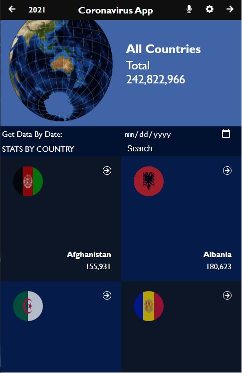

# React Covid19 info App

The application shows information about the coronavirus situations in the world. It is built around an API to fetch the needed data. It can show information on the country level as well as region and sub-region levels. You can actually find covid19 information using a date filter. This is a capstone project for my React/Redux course at Microverse Inc.

# Built with:
1. HTML
2. CSS
3. JavaScript
4. React
5. Redux

# Demo Links
view App [here](https://github.com/Kossi-stack/Covid-19-world-data/)
# App Video
[View App](https://www.loom.com/share/bbaa49978ddb497ea10ecdf3641038ab)

# App Screenshot (Mobile)

# App Screenshot (Desktop)

## Getting Started

- Click on the `Code` green drop down button then COPY.
- In your local PC, open your terminal in the folder you would like to clone the repository into
- Clone the repository with the command: `git clone (copied link)`; like so: `git clone https://github.com/Kossi-stack/Covid-19-world-data.git`
- After the clone, type in the command `cd Covid-19-world-data` to access the app directory on the terminal
- Run `npm install` to get all the project dependancies.
- Run `npm run start` to start the dev-server.

## Tests
- Run `npm test`.

👤 **Kossi-Stack**

- GitHub: [@githubhandle](https://kossi-stack.github.io/)
- LinkedIn: [LinkedIn](https://www.linkedin.com/in/kossifioklou2406/)

## Contributing

Contributions, issues, and feature requests are welcome!
Feel free to contribute

Feel free to check the [issues page](https://github.com/Kossi-stack/Covid-19-world-data/issues).

## Show your support

Give a ⭐️ if you like this project!

## 📝 License

This project is [MIT](./LICENSE) licensed.